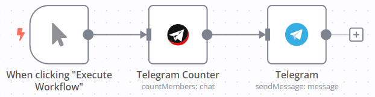
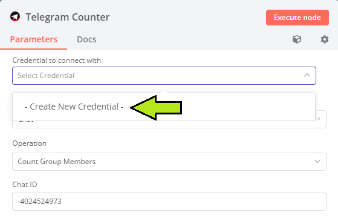
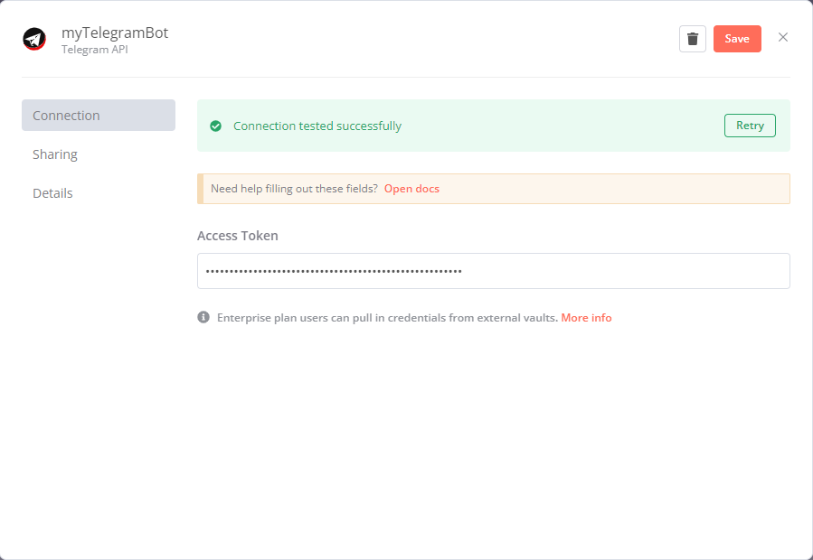
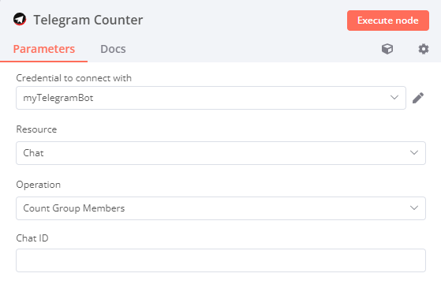
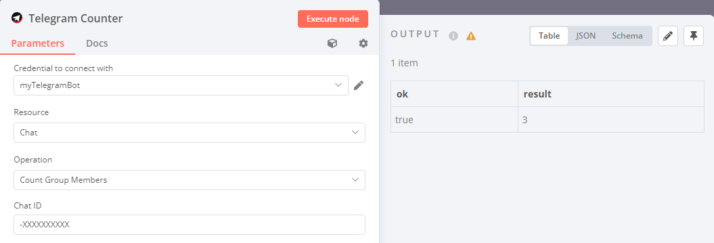
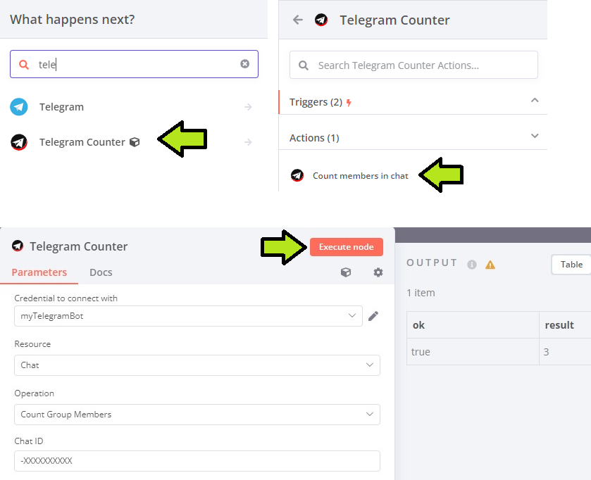
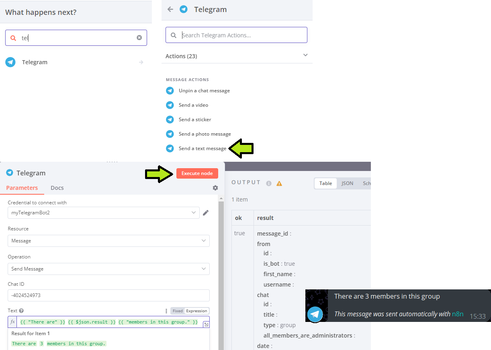

# n8n-nodes-telegramcount



This is an n8n community node. It lets you use the [Telegram API](https://core.telegram.org/api) to communicate with Telegram in your n8n workflows.

Telegram Counter counts how many members are present in a group chat and can be paired with the Telegram node to forward the result to your chat.

[n8n](https://n8n.io/) is a [fair-code licensed](https://docs.n8n.io/reference/license/) workflow automation platform.

[Installation](#installation)  
[Operations](#operations)  
[Credentials](#credentials)  
[Compatibility](#compatibility)  
[Usage](#usage)  
[Testing](#testing)  
[Logging](#logging)  
[Notes](#notes)  
[Resources](#resources)

## Installation

Follow the [installation guide](https://docs.n8n.io/integrations/community-nodes/installation/) in the n8n community nodes documentation.

## Operations

*   [Get chat member count](https://core.telegram.org/bots/api#getchatmembercount/)

| Operation | Method | Credentials required | Description |  
|-----------|:-----------:|:---------------------:|-----------|  
| Count Group Members | `POST` | `true` | Get the number of members in a group chat |

## Credentials

This node requires a [Telegram Access Token](https://docs.n8n.io/integrations/builtin/credentials/telegram/) in order to authenticate the Telegram Counter node.

Follow the pictures below to create a new credential.





## Compatibility

n8n@1.11.1

## Usage

1.  Add the Telegram Counter node to your workflow without selecting a trigger.
    
2.  Select the Telegram credentials you have created earlier.
    
3.  Enter the [Chat ID](https://docs.n8n.io/integrations/builtin/app-nodes/n8n-nodes-base.telegram/#get-the-chat-id). I recommend using @RawDataBot or @raw\_data\_bot.  
    
    
4.  Press the `Execute node` button to test the node and to output data. The integer in the result column is the number of members in the group chat your inserted Chat ID corresponds with.  
    
    

## Testing

### Node Development

The following steps were taken in order to verify the functionality of the node:

1.  The steps stated in the [node building tutorial](https://docs.n8n.io/integrations/creating-nodes/build/programmatic-style-node/#step-7-update-the-npm-package-details):
```    
# We built and linked our node.
# In my node directory (werkplaats-5-cloudshift-n8n-kolibrie\\nodes)
npm run build npm link
```

```    
# We linked our node to n8n.
# We created a 'nodes' directory because it was not present yet.
# In the nodes directory within our n8n installation (.n8n/nodes)
npm link n8n-nodes-telegramcount
```
    
2.  We then added the Telegram Count node to a new workflow. We set the [credentials](#credentials) and [Chat ID](#usage) as mentioned earlier. We executed the node to make an API request:
    



3.  Lastly we added a Telegram node to our workflow to send the result of the API request to the corresponding group chat in a string: 

### Problems

The major problem we initially encountered occurred during testing. We were unable to add our custom node to a workflow. We suspect this was caused by a clash between the API name of the custom node and the API name of the existing Telegram node. We solved this by changing the API name from `telegramApi` to `TelegramApi` at every occurrence in our custom node package.

### Testing Manual

## Logging

Basic logging is implemented in the node code. Logs are printed in the same terminal as your active n8n session. Implementing [n8n's built-in logging](https://docs.n8n.io/hosting/logging-monitoring/logging/#logging-in-n8n) seemed impossible. Consultation with a professional Software Developer confirmed these findings.

### Possibilities

*   Get parameters when all input is valid;
*   Get log when `operation` does not equal `'countMembers'`;

### Log Limitations

It seems impossible to undermine the built-in error handling of n8n. We were limited to JavaScript's `console.debug`.

*   No log when "Chat ID" is empty or has not enough characters;
*   No log when `resource` does not equal `'chat'`;
*   No log with the caught error.

### Tests

When errors are caught by n8n, `console.debug` does not get executed. This was tested by creating errors on purpose in hopes of activating code blocks with `console.debug`:

*   Leaving "Chat ID" empty;
*   Only input 1 character in "Chat ID";
*   Selecting basic `resource: 'Custom API Call'`.

## Notes

### Limitations

*   The node does not raise an error when the "Chat ID" is empty or invalid, as opposed to the original Telegram node;
*   The node cannot be activated with the built-in Telegram trigger (for example: send chat member count when a text message is sent);
*   Limited [logging](#log-limitations).

### Bugs

There are no known bugs.

### Unoptimized

*   [Logging](#log-limitations)
*   Enable admin to configure whether member count message in Telegram is visible only for them or entire group chat;
*   Node does not raise an error when "Chat ID" is invalid;
*   Check whether resource and/or operation user input is present in respective arrays.

### Future implementations

*   Reply Keyboard to enable user to request member count with one click/tap;
*   More API endpoints.

## Resources

*   [n8n community nodes documentation](https://docs.n8n.io/integrations/community-nodes/)
*   [Telegram homepage](https://telegram.org/)
*   [Telegram API docs](https://core.telegram.org/api/)
*   [Telegram node our node code is based on](https://github.com/n8n-io/n8n/tree/master/packages/nodes-base/nodes/Telegram)