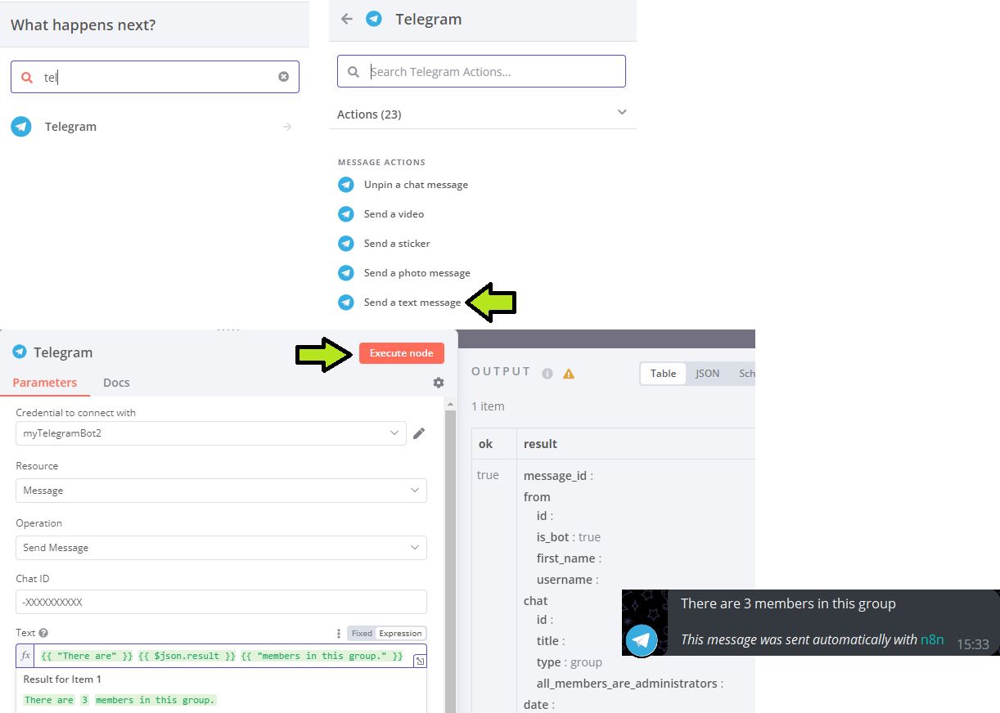
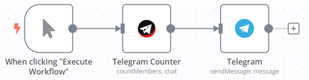

# Testing Manual

Follow these steps to test the `n8n-nodes-telegramcount`:

### 1. Clone repository
[Clone](https://docs.github.com/en/repositories/creating-and-managing-repositories/cloning-a-repository#cloning-a-repository) the repository to your local computer.


### 2. Open repository

Open the repository in your IDE.

### 3. Installation

Install node dependencies:

```    
npm i
```

Install n8n:

```    
npm install n8n -g
```        

### 4. Building and Linking

```    
# In node directory (werkplaats-5-cloudshift-n8n-kolibrie\nodes)
npm run build 
npm link
```

```
# In the nodes directory within your n8n installation (.n8n/nodes)
# Create .n8n/nodes directory if missing
npm link n8n-nodes-telegramcount
```

### 5. Run n8n

To start n8n:
```
n8n
# or
n8n start
```

To start n8n with a [tunnel](https://docs.n8n.io/hosting/installation/npm/#n8n-with-tunnel) in order to test other triggers:
```
n8n start --tunnel
```

### 6. Create Workflow

Add the Telegram Count node to a new workflow. Set the [credentials](./README.md#credentials) and [Chat ID](./README.md#usage) as mentioned in the [README](README.md). Execute the node.
    


Your workflow will look like this:


### 7. Optional: Expand Workflow

Add a Telegram node to your workflow to send the result of the API request to the corresponding group chat as a string:



Your workflow will look like this:


