# n8n-nodes-telegramcount

This n8n community node is an expansion on the already existing Telegram node. It contains a few API calls the orginal node doesn't have.

Currently, you can use these API calls with this node:
`getChatMemberCount, sendDice, createChatInviteLink, exportChatInviteLink`


## Table of Contents
1. [Prerequisites](#prerequisites)
2. [Installing this node](#installing-this-node)
3. [Set-up within n8n](#set-up-within-n8n)
  
   3.1 [Bot Token](#bot-token)

   3.2 [Adding the Telegram Bot Token to n8n](#adding-the-telegram-bot-token-to-n8n)

   3.3 [Getting the Chat ID](#getting-the-chat-id)

   3.4 [Additional notes](#additional-notes)


4. [Usage](#usage)

    4.1 [Troubleshooting](#troubleshooting)

5. [Dev stuff](#dev-stuff)

    5.1 [Logging](#logging)

    5.2 [Testing](#testing)

6. [Notes](#notes)


## Prerequisites

You need the following to run this node:

* [git](https://git-scm.com/downloads)
* Node.js and npm. Minimum version Node 16. You can find instructions on how to install both using nvm (Node Version Manager) for Linux, Mac, and WSL [here](https://github.com/nvm-sh/nvm). For Windows users, refer to Microsoft's guide to [Install NodeJS on Windows](https://docs.microsoft.com/en-us/windows/dev-environment/javascript/nodejs-on-windows).
* Install n8n with:
	```
	npm install n8n -g
	```
* Recommended: follow n8n's guide to [set up your development environment](https://docs.n8n.io/integrations/creating-nodes/build/node-development-environment/).


## Installing this node

To use this node, you need to do the following:

1. Clone this repo:
    ```
    git clone https://github.com/Rac-Software-Development/werkplaats-5-cloudshift-n8n-kolibrie.git
    ```
2. Open a terminal and change directory to the folder where you cloned this repo. E.g. `cd C:\Users\<Username>\Desktop\werkplaats-5-cloudshift-n8n-kolibrie`

   Run `npm i` to install dependencies.


   Run `npm ruin build` to build the node.


4. Change directory to the n8n folder on your machine. E.g. `cd C:\Users\<Username>\.n8n`
5. Run `n8n-nodes-telegramcount` to install this node.


## Set-up within n8n

### Bot Token
To use this node, you will need to create a Telegram Bot first, or use a Bot Token from an existing one. 

If you don't have a bot, follow the guide on [Telegram's website](https://core.telegram.org/bots/features#creating-a-new-bot).

If you already have a Telegram bot, open the chat with `@BotFather` and send the `/mybots` command, choose your bot from the list and then choose `API Token`.

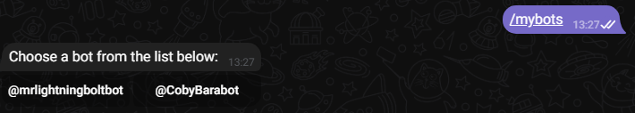
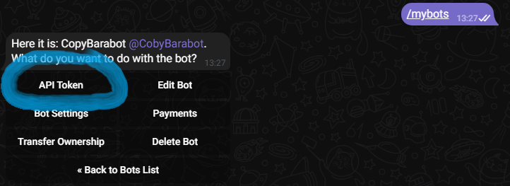

The token should look like this: `110201543:AAHdqTcvCH1vGWJxfSeofSAs0K5PALDsaw`.


### Adding the Telegram Bot Token to n8n

You will need to add the token as a credential before using this node in your n8n workflow.

To add the token you will need to do the following:
* Click on credentials in the left-hand menu. (:key:)
  
* On the Credentials page, click on `Add Credential`.
* In the pop-up, search for `TelegramExpansion API` and then on `Continue`.
  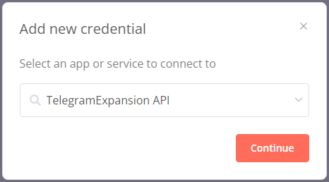
* Fill in the Access Token and then click on `Save`.
  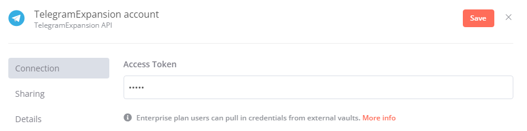

```
Note that you will need to repeat the same steps for the Telegram API credentials as well, using the same Bot Token.
```


### Getting the Chat ID

You will also need an Chat ID in onder for the bot to send messages in chats. You can get your Chat ID from a private chat by starting a chat with `Telegram Bot Raw` and sending the `\start` command. The bot will send a message back containing the JSON output from the chat. The outputs after `id` from either `from` or `chat` will work.

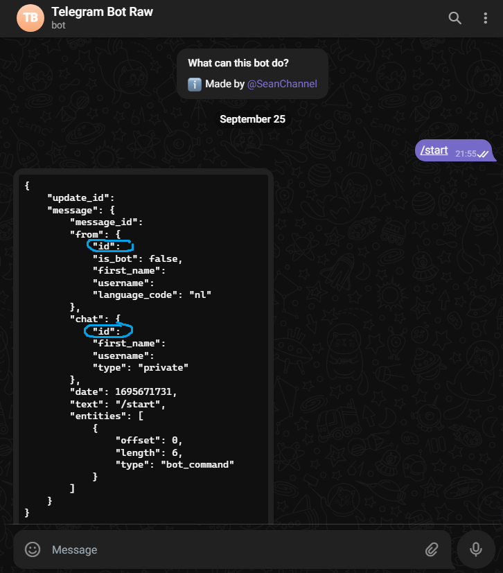

Another way to obtain the Chat ID is by using the web version of telegram. In the URL you will find the Chat ID of the chat you are currently reading. It will look something like this: `https://web.telegram.org/a/#xxxxxxxxxxxxxx` , you will need the ID after `#`. Depending on the type of chat, the ID might start with a number or `-`.

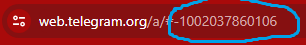


### Additional notes

When using the `Create an invite link` or `Create a new invite link` actions, your chat needs to be an super chat and the bot needs to be admin and have privileges.

A simple way of doing this is by opening the menu of a group chat where your bot is also a member in. By clicking on edit and then `Administrators`, you can add your bot as new admin and give it additional privileges. It will need `Change group info` to create invite links.

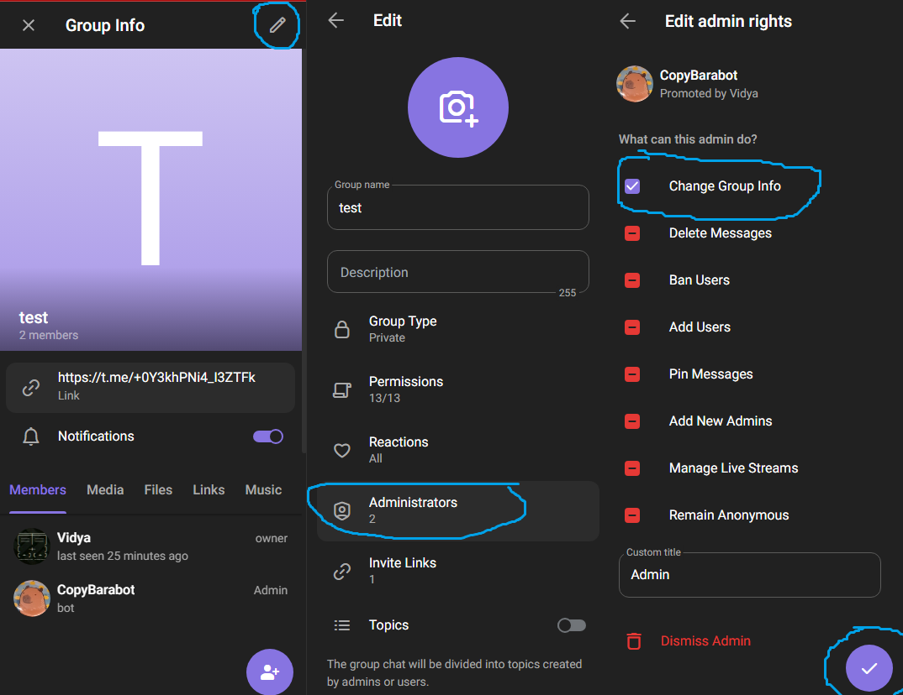


## Usage

To use this node, click on `Add first step` on the canvas or the plus sign on the right hand side.

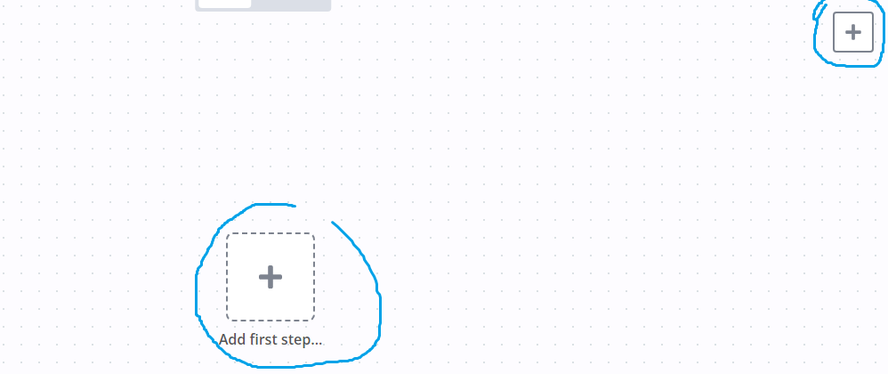

A menu will open, select `Manually` to add a trigger to the canvas.

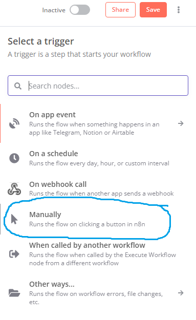

`When clicking "Execute Workflow"` will be added to the canvas, on the right of it you will see a plus sign. Click on it to add another node. A new menu will appear and search for `TelegramExpansion`. If you click on it, you will see the available actions of this node.

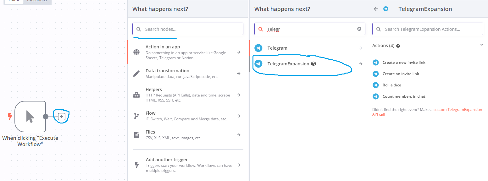

After clicking on an action, a new screen will appear. In this screen you will need to select the credentials you have added earlier and fill in the Chat ID. If you click on the dropdown menu underneath `Credential to connect with`, a list will appear from which you can choose the credential you have added.

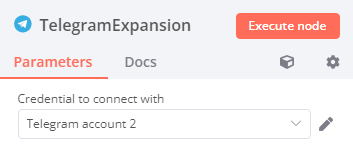

Then, you will need to fill in the Chat ID.

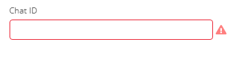

You will need to repeat this step for additional nodes. A way of preventing this, is to copy the node on the canvas and then changing the `Operation` of the node by double-clicking on it.

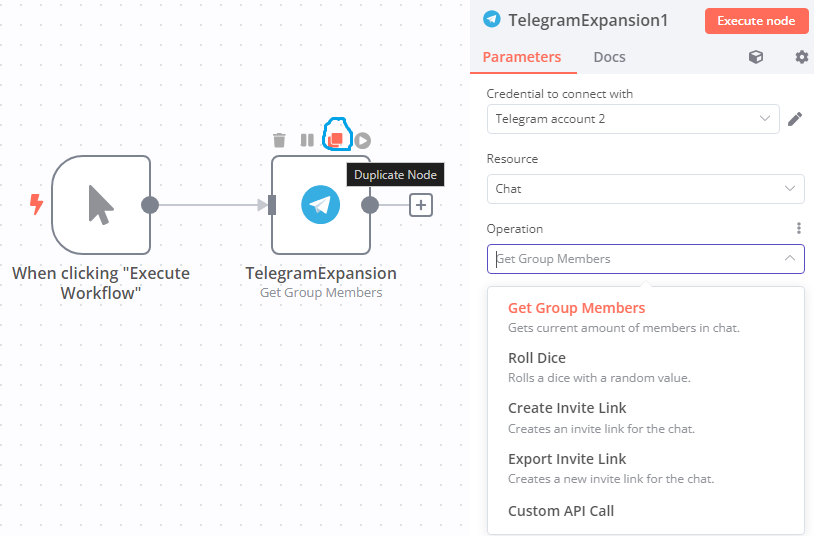

When using the `Get Group Members`, `Create Invite Link` or `Export Invite Link` actions, you will need to add a Telegram message node to it, in order for the bot to send a message in chat. The steps are similar for when you were adding the actions from the `TelegramExpansion` node, but this time you will need the actions from the native `Telegram` node. `You don't need to do this when using the `Roll dice` action.`

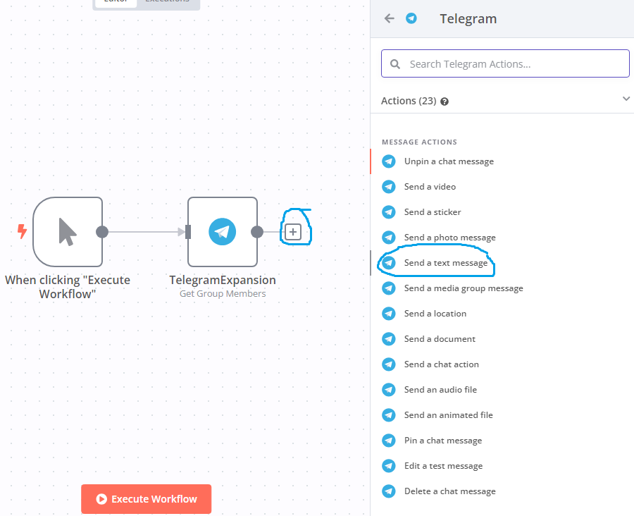

You will need to repeat the steps for adding credentials and the Chat ID here.
In order to send a text message to the chatroom in Telegram you need to fill in the `Text` field. Before doing this you need to execute the previous node, by clicking on the `Execute previous nodes` button.

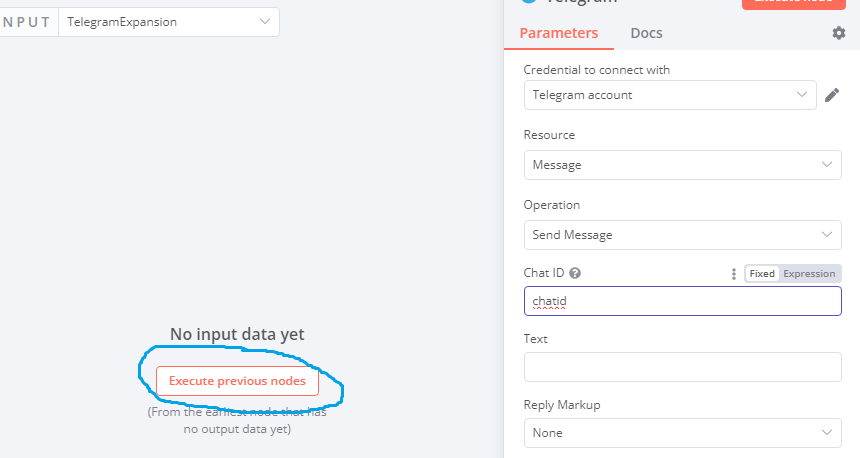

If everything went well, you will see the JSON output from the previous node. Click on `result` and drag it to `Text`. The text will change to `{{ $json.result}}`.

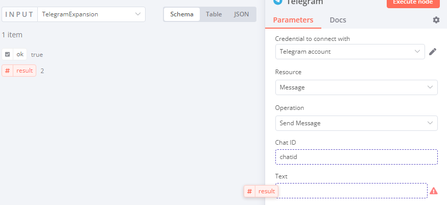

After that, you can click on `Execute node` or go back to the canvas and click on `Execute workflow`. Your bot will send a message on Telegram. 

### Troubleshooting

If your bot hasn't sent a message in your Telegram chat, check to make sure if you have added the right credentials or filled in the right Chat ID. Make sure to not add any spaces when copying the id. Also check if your bot has the right permissions and is an admin when it can't generate an invite link.


## Dev stuff

### Logging

There is some logging. You can read logs in the terminal from where you are running your current n8n session.

### Testing

You can test the nodes by following the same steps as described in [usage](#usage). When clicking on the `Execute node` button, you will see an output screen on the right. The JSON output is displayed there, as well as in the logs. Errors will also show on the canvas.

Additionally, you can test the output without having your bot sending a chat message on Telegram by removing the Trigger node and the `SendMessage` action node.

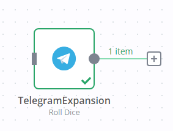
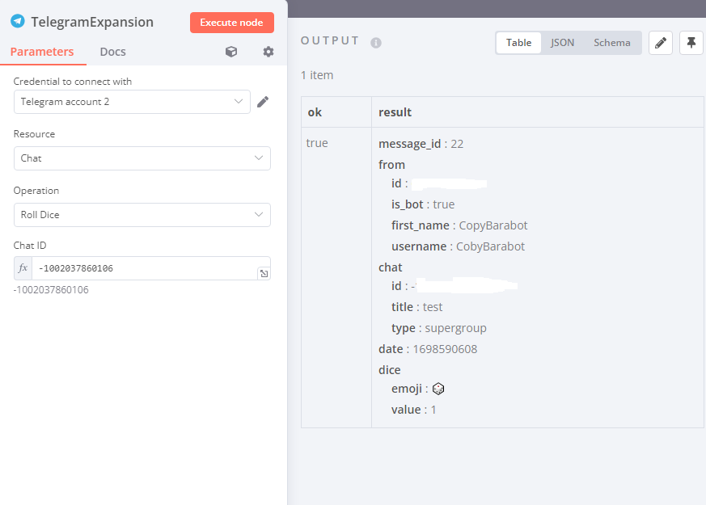


## Notes

There is a lot of repetition within the code, this could be optimised in the future.

It is possible for the user to use `{{json.result}}` as ChatID. The node will still execute but not successfully. There wasn't enough time to figure out why this happens, so this needs to be fixed in another update.

It's unknown if errors will also show up in the logs, as it was difficult to test this. n8n usually catches errors and gives feedback to the user.
